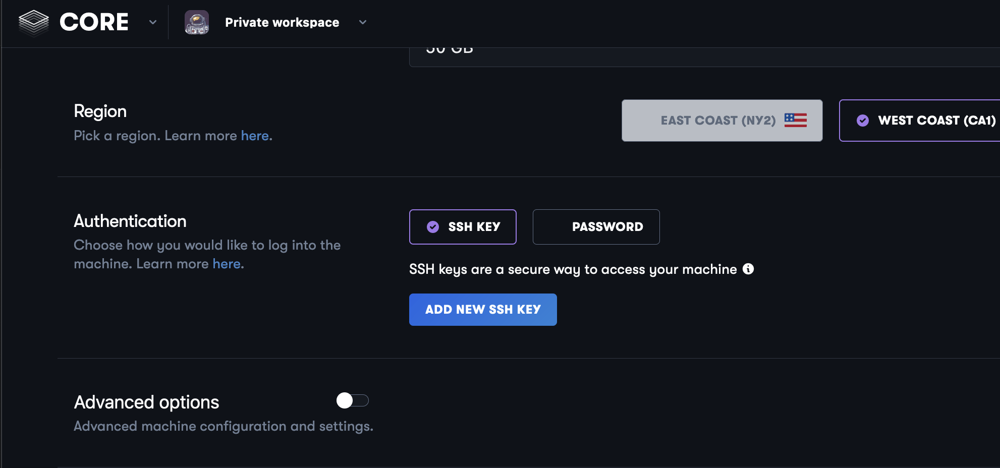

# Paperspace Core


This is a setup guide for Machine Learning developers on [Paperspace Core](https://www.paperspace.com/core). Paperspace Core allows users to create and connect to a GPU-enabled Virtual Machine and utilize it for their Machine Learning purposes.

The following steps will walk you through how to configure a Paperspace Core machine and utilize it for your Fast.ai journey.


## Pricing

Pricing is standard across all Paperspace regions. Sample pricing for machines with 50 GB of SSD storage are below.

- **GPU+:** 8 vCPUs, 30 GB RAM, Nvidia Quadro M4000 - $0.457 hourly
- **P4000:** 8 vCPUs, 30 GB RAM, Nvidia Quadro P4000 - $0.517 hourly
- **P5000:** 8 vCPUs, 30 GB RAM, Nvidia Quadro P5000 - $0.787 hourly
- **A6000:** 8 vCPUs, 45 GB RAM, Nvidia Ampere A6000 - $1.897 hourly


## Create an Account

You can create a Paperspace account by clicking on this [link](https://console.paperspace.com/signup). When you create a Paperspace account, you can choose to sign up with an email address or with your GitHub or Google account.


## Select the Core product[](https://docs.paperspace.com/core/quick-start/#select-the-core-product)

When you first log into Paperspace, select Core from the product dropdown:


## Configure a Machine

- Navigate to the *Machines* tab in Paperspace Core
- Click *Create a Machine*
- Select *ML-in-a-Box Ubuntu 20.04*


- Select your *Machine Type* and *Region*
- For authentication, choose [ssh](https://docs.paperspace.com/core/compute/how-to/connect-with-ssh)


## Adding SSH Keys

You can add SSH keys on the Create page by clicking on **Add New SSH Key**. Fill in the form by entering in a name, adding your Public SSH key, and clicking **Add**.

**Note**: If you need to create an SSH click [here](https://docs.paperspace.com/account-management/account/security/ssh-keys#generating-an-ssh-key) for information on how to create one.




## Optional: Review advanced options

You can optionally configure **Advanced Options** such as auto-snapshots, static public IP addresses, etc. No changes to the default configuration are required for the Fast.ai course. 


## Create Machine

Once you click **Create**, your machine will begin provisioning. If you set the machine to start after provisioning is complete, it will become available after it starts. The provisioning process typically lasts about one minute.


## Connect to Your Machine

- Click *Connect To Your Machine*

This will provide you with the username and IP address to connect to your machine. You will need to modify the command to allow you to connect to the Jupyter server on your machine. The command to run in your local terminal will look like the example below:
```
ssh -L localhost:8888:localhost:8888 paperspace@123.456.789.012
```

**Note:** By default, the Linux user is `paperspace`.


## Installing Libraries

The image selected, ML in a Box, has all the NVIDIA and CUDA drivers that you will need to run on a GPU already installed. It also comes with useful Machine Learning Python packages pre-installed such as scikit-learn, NumPy, PyTorch, and TensorFlow.

However, following the steps below will set up an environment based on the Fast.ai requirements of this specific course.

First, clone the [Fast.ai setup GitHub repository](https://github.com/fastai/fastsetup) to your machine using:

```
git clone https://github.com/fastai/fastsetup.git
```

Move into the directory you just cloned:
```
cd fastsetup
```

Run the Conda setup script:
```
bash setup-conda.sh
```

Once Conda is installed, install the required packages for this course using the command below and following the prompts:

```
conda install -c fastai -c pytorch fastai
```

Once you run the above steps, your environment should be ready for the Fast.ai course!


## Clone the Fast.ai Notebooks

Once the above libraries are installed, navigate to your desired directory and run the command below. This will clone the [Fast.ai course GitHub repository](https://github.com/fastai/fastbook.git) to your machine. 

```
git clone https://github.com/fastai/fastbook.git
```

Move into the directory you just cloned:
```
cd fastbook
```

Finally, spin up a Jupyter server using:
```
jupyter notebook
```

After the Jupyter server is running, copy and paste the url that was outputted in your terminal into your local browser to interact with the Jupyter enviornment and Fast.ai notebooks.


## Stopping Your Instance

**Make sure to shut down your machine when you are done**

- Click on the machines tab
- Click the three dots at the top right of the machine you want to shut down
- Select “Shutdown”

Note you can also stop the instance from the VM using: 
```
sudo shutdown now
```

